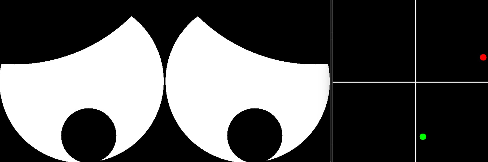

## Non Verbal Expressive Eye Generator 

This repository contains code for the eye-generation mechanism for Alfred the friendly indoor robot. 

## V1
- Basic parametric eye model rigged using parametric circles.

## V2
- Advanced eye model rigged with control points on splines.
